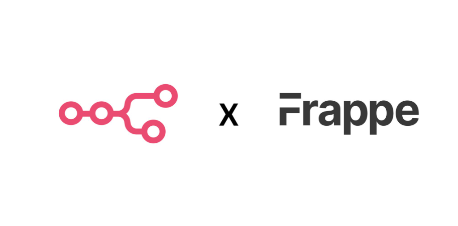
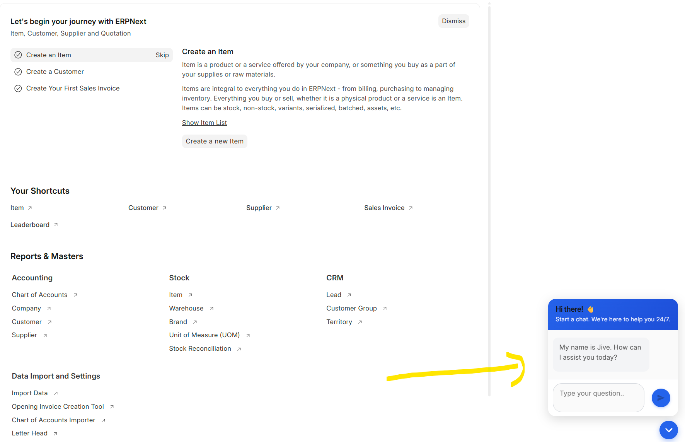
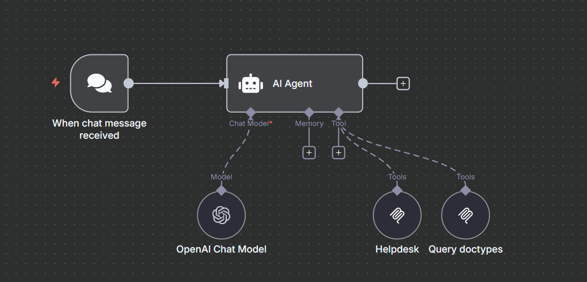
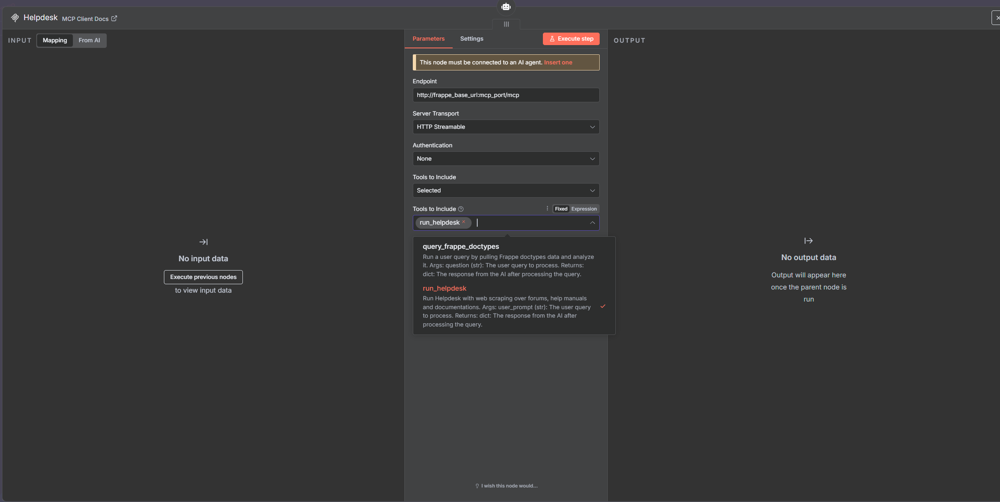
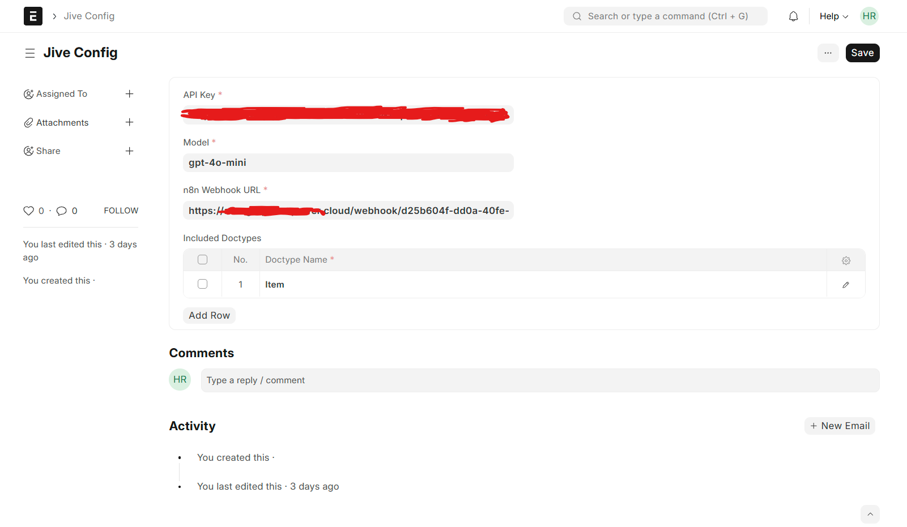
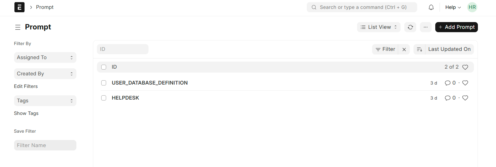
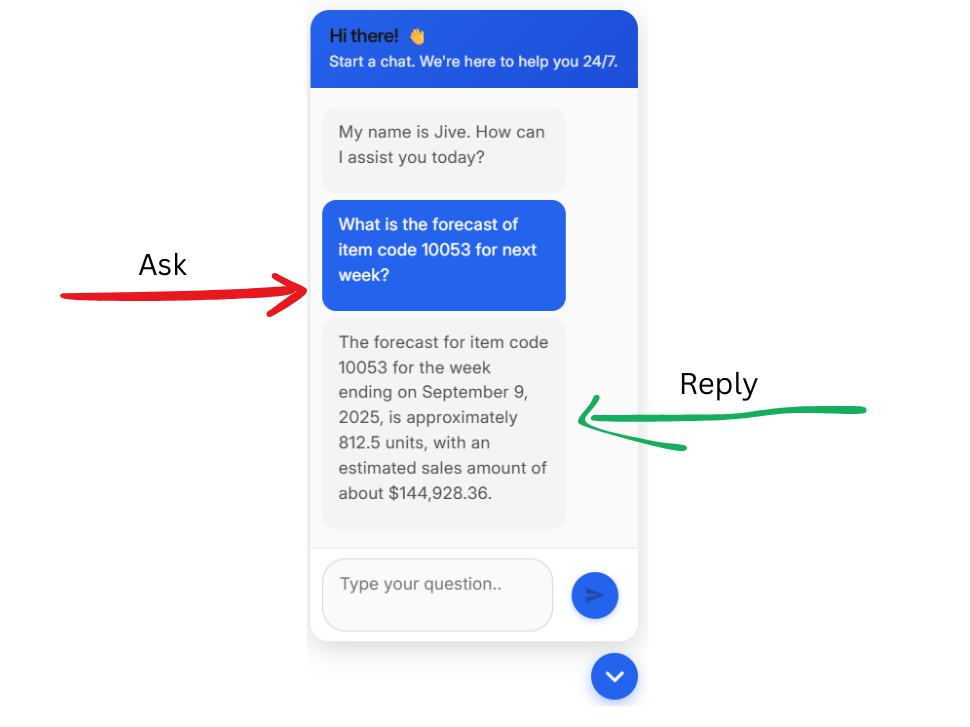

# **AmPower-Jive**

Having conversation with your data just got real. Introducing Ampower Jive, crossover of Frappe and n8n, a conversational AI toolkit that comes bundled as a Frappe app.



Its backed by Anthropic's Model Context Protocol, OpenAI's LLMs and Frappe's webserver with ability to interpret natural language queries and generate intelligent, 
contextual responses using documents, data, and integrated tools with full access to the data from Frappe, or from external sources, with customizable tools and resources.

<div align="center">High level architecture</div>


---

## **Features**

1. **AI Agent Powered by n8n**

   * Leverages n8n’s workflow automation engine to create intelligent, autonomous agents capable of executing multi-step tasks without manual intervention.
   * Supports branching logic, conditional flows, and event-driven triggers, enabling dynamic decision-making and adaptive responses.
   * Allows easy customization of agent behavior through a visual drag-and-drop interface, making it accessible even for non-developers.

2. **Generative AI Integration**

   * Combines OpenAI’s advanced language models with **MCP (Model Context Protocol)** to enable natural, context-aware interactions.
   * Agents can understand complex, multi-turn queries and produce insightful, human-like responses.
   * Capable of generating text, drafting summaries, answering domain-specific questions, and even creating structured data outputs ready for processing in Frappe or other systems.
   * Context retention across conversations allows more personalized and relevant outputs.

3. **External Data Sources**

   * Seamlessly connects to CRMs, ERPs, eCommerce platforms, APIs, and databases to fetch, transform, and act on live data.
   * Supports scheduled data syncs, real-time webhooks, or event-based triggers for up-to-date insights.
   * Includes out-of-the-box connectors for popular services like Shopify, NetSuite, Google Sheets, REST APIs, and more.
   * Data can be pre-processed or enriched via n8n workflows before being used by the AI agent.

4. **Large Variety of Tools Available**

   * Access to hundreds of pre-built n8n nodes for automation, integrations, and utilities.
   * Supports tools for data processing (ETL), messaging (Slack, Email, WhatsApp), file operations, and analytics.
   * Extendable with custom nodes and MCP tools for organization-specific use cases.
   * Enables chaining multiple tools together for complex workflows, such as fetching data, analyzing it with AI, and pushing results back to Frappe or another system automatically.

---

## **Installation**

### **Prerequisites**

* Frappe Framework (v14+ recommended)
* Python 3.8+
* OpenAI API Key
* NodeJS v20+

### **Steps**

1. **Clone the Repository**

```bash
git clone https://github.com/Ambibuzz/AmPower-Jive.git
cd ampower_jive
```

2. **Install the App**

```bash
bench get-app https://github.com/Ambibuzz/AmPower-Jive.git
bench install-app ampower_jive
bench --site [your.site.name] migrate
```

---

## **MCP Server Configuration**

AmPower-Jive relies on an MCP (Model Context Protocol) server connected over n8n to process tool calls and data interactions.

### **Prepare the process configurations**

AmPower Jive requires an MCP server connected via n8n for tool calls and data interactions.

**Run the container with MCP port**
```
docker run -td  --restart unless-stopped  --name <name of docker_user name> -p 15000:<http port> -p 33000:<mcp port> <docker image> /bin/bash
```

Add the following lines in file: `bench-root-path/config/supervisor.conf`

```ini
[program:frappe-mcp]
command=bench --site [your.site.name] execute ampower_jive.mcp.config.setup.start_mcp_server
directory=/opt/bench/frappe-bench
user=erp-user
autostart=true
autorestart=true
redirect_stderr=true
stdout_logfile=/opt/bench/frappe-bench/logs/mcp.log
stdout_logfile_maxbytes=50MB
stdout_logfile_backups=10
environment=FRAPPE_SITE=[your.site.name],MCP_HOST=0.0.0.0,MCP_PORT=[your_mcp_port]
```

### **Update supervisor and start server**

```bash
sudo supervisorctl reread
sudo supervisorctl update
sudo supervisorctl restart frappe-mcp
```

For more details, refer to the [MCP README](https://github.com/Ambibuzz/AmPower-Jive/blob/development/ampower_jive/mcp/README.md).

---

## **n8n UI Config**

```
cd apps/ampower_jive
npm install
bench build --app ampower_jive
```

This will build the chat UI and display the jive interface on frappe desk.



## **Usage**

### **Accessing MCP Dashboard**

Go to:
`your-site-base-url/app/mcp_dashboard`

### **Using the System**

* Just as whatever queries you have, if it involves reading some data, or running a web search, or reasoning, the system will automatically handle it in the backend.

---

## **Flow control across the app**


```
User sends a query (calls webhook)
    ↓
Webhook triggers an n8n workflow
    ↓
n8n agent processes the call (resources/read, tools/call)
    ↓
Response returned to UI
```

**N8N workflow**



**Configure MCP Tool in n8n**

1. Add an MCP Client node in your n8n workflow.

2. Enter your MCP endpoint URL.

3. Once the URL is validated, the Tools to Include dropdown will automatically list all available MCP tools from your server.



**List of MCP Tools in AmPower Jive**
```
cd ampower_jive/ampower_jive/mcp/tools
```

**MCP Tools Registry**
```
cd ampower_jive/ampower_jive/mcp/registry/tools_registry.py
```

## 🔧 Jive Config Setup

The **Jive Config** singleton doctype is where you define the core settings that power AmPower Jive.



### Steps

1. **OpenAI API Key**  
   Enter your OpenAI API key to enable AI-powered responses.

2. **Model Name**  
   Specify the model you want to use (e.g., `gpt-4`, `gpt-4o-mini`, etc.).

3. **n8n Webhook URL**  
   Copy the webhook URL from your n8n **Webhook node** and paste it into the *N8N Webhook URL* field.
   Also do update N8N webhook Url to `public/main.bundle.js`

4. **Include Doctypes**  
   Define which doctypes Jive can access in the *Include Doctypes* child table.  
   - Acts as a **permission layer**.  
   - Supports **multiple doctypes**.  
   - Jive will only read data from the doctypes listed here.

## 🔧 Prompt

For each tool in MCP, Jive requires a prompt that defines its purpose and use case for the associated doctype or tool.
Go to the Prompt List and create a new prompt.

For reference, we have included examples that demonstrate the recommended prompt structure.
⚠️ The prompt names provided are already defined in the Jive application — please use these exact prompt document names without modification.

**USER_DATABASE_DEFINITION**

```
**Important Information**

The available data is organized based on ABC Inventory Analysis, which categorizes items according to their sales performance and inventory value.

Item A/B/C/D Forecasts: These represent forecasted sales for inventory items, classified by performance.
```

**HELPDESK**
```
You are an AI Helpdesk Assistant for the Frappe Framework and ERPNext system.

Your purpose is to provide accurate, factual, and consistent answers strictly based on:
The core Frappe Framework (as documented in official Frappe documentation)
The standard ERPNext application (as shipped in the official ERPNext GitHub repository)

Strict Rules:
1. Only answer questions related to the core Frappe Framework and the standard ERPNext app.
2. If a question involves a custom app, third-party module, marketplace app, or non-standard doctype:
```



## Working


---

## **Testing (cURL)**

```bash
curl -X POST http://localhost:<mcp port>/mcp \
  -H "Content-Type: application/json" \
  -d '{
    "jsonrpc": "2.0",
    "id": "chat-with-file",
    "method": "tools/call",
    "params": {
      "name": "chat_with_gdrive_file",
      "arguments": {
        "file_id": "<your_file_id>",
        "prompt": "Summarize this file"
      }
    }
  }'
```

---

## **Troubleshooting**

* **Server not starting:** Check logs at `logs/mcp.log`.
* **Permission issues:** Ensure `erpn-user` owns `/opt/bench/frappe-bench`.
* **Database connectivity:** Restart services if MariaDB isn’t reachable:

```bash
sudo supervisorctl restart all
```

---

## **Contact**

**Amibuzz Technologies LLP**
📧 [buzz.us@ambibuzz.com](mailto:buzz.us@ambibuzz.com)

---

## **License**

**MIT**

