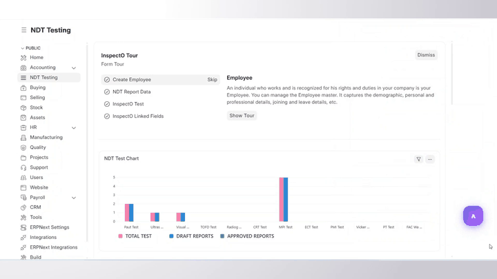
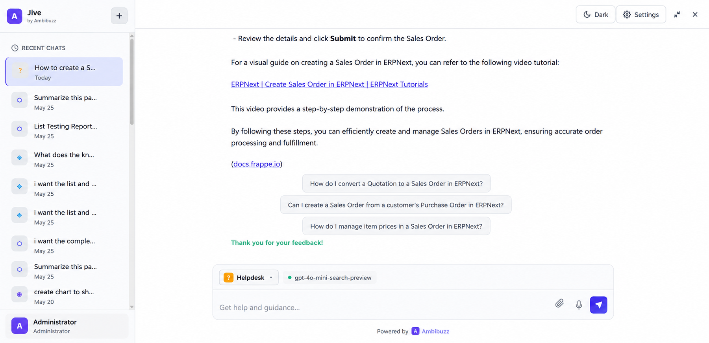
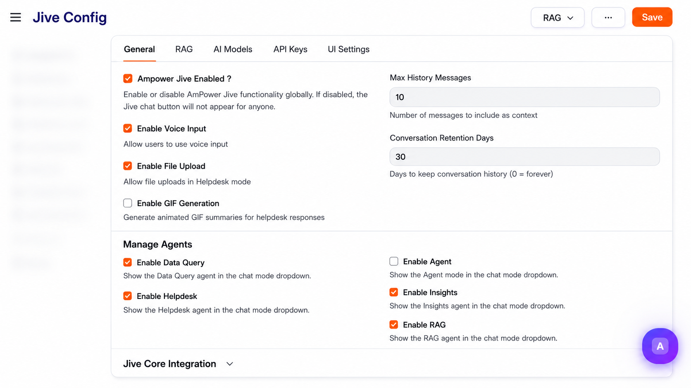
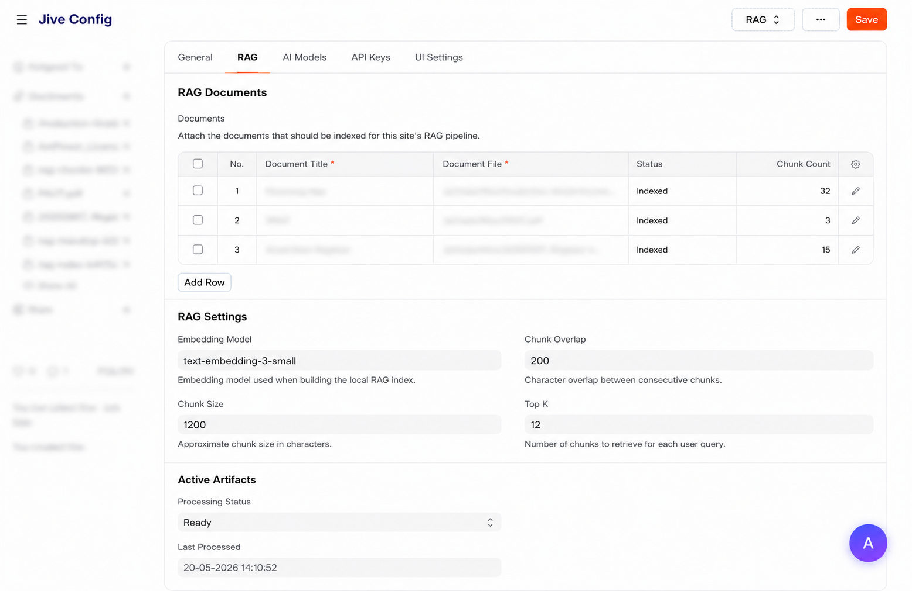
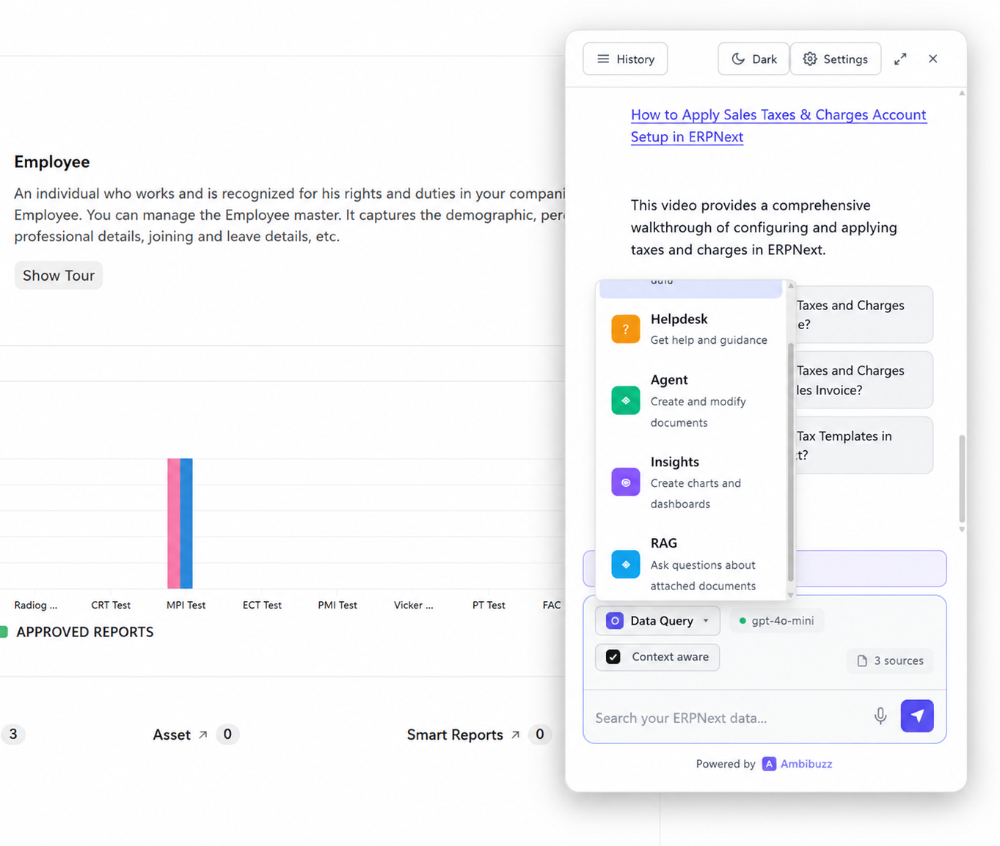

# AmPower Jive

AmPower Jive is a conversational AI assistant for Frappe/ERPNext powered by LangChain and LangGraph. It enables users to query business data, get contextual help, perform document operations using natural language, track token usage locally, and run tenant-side RAG inside `ampower_jive`.

This README is written for self-hosted and marketplace installations. Bring your own OpenAI API key and review the data-sharing notes below before enabling the assistant in production.

Compatible with Frappe/ERPNext v15 and v16.

For a step-by-step setup and usage walkthrough, open the in-app documentation page at `/app/jive-documentation`.

## Demo



## Architecture

Jive uses a modern AI architecture built on:

- **LangChain** - For LLM interactions and tool orchestration
- **LangGraph** - For stateful agent workflows with conditional logic
- **OpenAI GPT Models** - Current LLM provider for chat, insights, agent, helpdesk, and embeddings
- **Frappe Framework** - Native integration with ERPNext permissions and security
- **Jive Core Integration** - Optional centralized control for agent catalog, prompts, and model settings

## LLM Provider

AmPower Jive currently uses **OpenAI** as the LLM provider.

- Data Query, Helpdesk, Agent, and Insights modes use OpenAI-backed chat models
- RAG embeddings are also generated through OpenAI
- Model and temperature settings can be configured per mode in Jive Config or Jive Core
- You must provide your own OpenAI API key
- If Jive Core is enabled, it can supply prompts and model settings, but the provider is still OpenAI unless your deployment is changed externally

## Privacy, Data Sharing, and Risk

AmPower Jive is designed to stay inside your Frappe/ERPNext tenant, but some request content is sent to OpenAI so the assistant can generate answers. Please review this section carefully before using it with business data.

### What may be shared with OpenAI

- Your message or instruction
- A compact conversation history when the mode needs context
- Current page or document context when context-aware chat is used
- Allowed doctype and schema summaries so the model understands the data structure
- Query results, record snippets, chart data, counts, or other minimal data needed to answer the request
- Agent mode planning details, including the fields and document data needed to prepare a safe write operation
- Extracted text or chunks from Helpdesk file uploads or RAG documents when those modes are used

### What is not shared by default

- Your full ERPNext database
- Doctypes that are not in the allowed list
- Data the current user cannot access through Frappe permissions
- Write actions before the user approves the Agent plan

### Things to review before production

- Confirm your organization is comfortable sending the relevant prompt and result data to OpenAI
- Review the allowed doctype list, prompts, and default models before publishing the app
- Keep the OpenAI API key secure and site-specific
- Test Agent mode on a non-production site first

## Features

### 1. Data Query Mode
- Query your ERPNext data using natural language
- Search across multiple doctypes simultaneously
- Get counts, summaries, and detailed records
- Respects Frappe user permissions automatically
- Only uses doctypes added to the Jive Config allowlist
- Configurable model and temperature settings

### 2. Helpdesk Mode
- Get help with ERPNext features and workflows
- **Context File Upload** - Upload PDF, DOCX, CSV, TXT, MD, JSON files for custom Q&A
- Per-session context management
- Step-by-step guidance for common tasks
- **Voice Input** - Speak your queries (Web Speech API)
- Available in desk chat and on the website helpdesk page for logged-in website users

### 3. HD Tickets Mode
- Ask about live **HD Ticket** records, ticket status, recent updates, and customer activity
- List visible tickets, open a specific ticket summary, and continue with follow-up questions in the same conversation
- Can prepare ticket creation, internal comment, and communication actions using the Helpdesk app flow
- Respects Helpdesk visibility, customer scope, and normal Frappe permissions
- Available in desk chat and on `/jive-helpdesk-chat` when Helpdesk is installed and **Enable HD Tickets** is turned on

### 4. Agent Mode
- Create, update, submit, and cancel documents
- **Planning Phase** - AI shows proposed changes before execution
- **User Approval** - Required confirmation for write operations
- Supports all standard Frappe document operations

### 5. Insights Agent Mode
- **Create visualizations** from your ERPNext data using natural language
- **Automatic chart creation** - Bar, Line, Donut, Number, and Table charts
- **Inline chart preview** - See chart data directly in the chat response
- **Prescriptive analysis** - AI-generated insights and recommendations
- **Smart workbook reuse** - Automatically finds and reuses existing similar charts
- **Follow-up suggestions** - Context-aware prompts for deeper analysis
- **Direct links** - One-click access to charts in Frappe Insights

**Requirements:** Frappe Insights app must be installed on your site.

**Example queries:**
- "Show me revenue by customer"
- "Create a monthly sales trend chart"
- "Top 10 items sold last month"
- "Sales breakdown by territory"

**Response includes:**
- Data summary with top entries
- Quick insights (trends, concentration analysis)
- Recommendations for action
- Follow-up suggestions
- Interactive chart preview
- Direct link to Insights workbook

### 6. Token Usage Logging
- Logs token usage for each interaction in the local `Ampower Jive Token Logs` table
- Updates the Jive Config usage counters for daily and monthly usage
- Supports local quota tracking even when Jive Core is not enabled
- Can also report usage to Jive Core when the integration is enabled

### 7. RAG
- RAG documents are uploaded and processed locally in `ampower_jive`
- Admins can configure chunk size, chunk overlap, embedding model, and top-k in Jive Config
- RAG queries use the locally built manifest, chunk store, and index
- Core is not required for RAG
- Choose **Legacy Site RAG** or **User Specific RAG** in Jive Config to switch the routing mode
- User-specific routing uses the `Jive Rag User` mapping to pick the correct `Jive Vector Data Base`
- A `Jive Rag User` mapping can link one user to one or more vector databases and optionally fall back by customer or customer ID
- `Default Vector Database` can be used as a fallback when user-specific mode is enabled and no direct mapping matches
- Each vector database stores its own manifest, index, and chunk store artifacts
- On the website helpdesk page, RAG appears as **Doc Help** when **Enable RAG Helpdesk** is enabled

**Typical flow:**
1. Open `Jive Config`
2. Add files in the `RAG Documents` table
3. Set chunk size, overlap, embedding model, and top-k
4. Click **Process RAG Documents**
5. Wait for the RAG status to become ready
6. Users select the RAG agent in chat and ask questions against the indexed tenant documents

**User Specific RAG flow:**
1. Open `Jive Config`
2. Set `RAG Pipeline Mode` to **User Specific RAG**
3. Open or create the required `Jive Vector Data Base` records
4. Add the source documents to each vector database
5. Create `Jive Rag User` mappings that link each user to one or more vector databases
6. Set `Default Vector Database` only if you want a controlled fallback
7. Click **Process User Specific RAG** and wait for the build to finish
8. Ask questions in **RAG** mode in desk chat, or in **Doc Help** on `/jive-helpdesk-chat` if portal helpdesk RAG is enabled

### 8. Website Helpdesk Chat Page
- A dedicated website page is available at `/jive-helpdesk-chat`
- The page requires login and is intended for **Website User** accounts
- Portal users can ask normal help questions in **Helpdesk** mode
- If Helpdesk is installed and **Enable HD Tickets** is enabled, the page also shows **HD Tickets**
- If **Enable RAG Helpdesk** is enabled, the page also shows **Doc Help**, which uses the current user's mapped RAG documents
- Portal access is limited to the helpdesk-style modes on that page and does not grant desk access or Jive Config access

### 9. Modern Chat UI
- Clean, dark-themed interface inspired by modern AI tools
- Chat history with conversation management
- Mode selector dropdown
- Real-time typing indicators
- Voice input with visual feedback
- Context file indicators



## Requirements

- **Frappe Framework / ERPNext** v15 or v16
- **Python** 3.10 or higher
- **Node.js** v18 or higher
- **OpenAI API Key**
- **Jive Core** if you want centralized agents, prompts, or model settings

## Installation

### 1. Get the app

```bash
cd /path/to/frappe-bench
bench get-app https://github.com/Ambibuzz/ampower_jive.git
bench --site your-site.local install-app ampower_jive
```

### 2. Optional: install Frappe Insights

```bash
bench get-app insights
bench --site your-site.local install-app insights
bench --site your-site.local migrate
bench restart
```

### 3. Optional: connect Jive Core

If you want managed agents or managed model settings, configure `ampower_jive_core` and set:

- Core site URL
- API key / bearer token
- Tenant site ID

### 4. Build and migrate

```bash
bench build --app ampower_jive
bench --site your-site.local migrate
bench --site your-site.local clear-cache
bench restart
```

## Configuration

### Step 1: Open Jive Config

Navigate to: `your-site.local/app/jive-config`

### Step 2: Configure Settings

#### General Settings
| Field | Description | Default |
|-------|-------------|---------|
| Active Jive | Enable/disable Jive | Unchecked |
| Enable Voice Input | Allow voice queries | Checked |
| Enable File Upload | Allow context file uploads | Checked |
| Max History Messages | Context messages for AI | 10 |



#### AI Models Configuration
| Field | Description | Default |
|-------|-------------|---------|
| Data Query Model | Model for data queries | gpt-4o-mini |
| Data Query Temperature | Creativity (0-1) | 0.3 |
| Helpdesk Model | Model for help queries | gpt-4o-mini |
| Helpdesk Temperature | Creativity (0-1) | 0.3 |
| HD Tickets Model | Model for ticket summaries and follow-up responses | gpt-4o-mini |
| Agent Model | Model for write operations | gpt-4o-mini |
| Agent Temperature | Creativity (0-1) | 0.2 |
| Agent Require Approval | Require user approval | Checked |

#### API Keys
| Field | Description |
|-------|-------------|
| LLM Provider | OpenAI |
| OpenAI API Key | Your OpenAI API key |

#### Jive Core Integration

When Jive Core is enabled, the local app treats core as the source of truth for:

- available agent catalog
- core-managed prompts
- core-managed visibility and enablement flags

The local app still keeps:

- user permissions
- session history
- local document upload support for Helpdesk mode

For RAG, the tenant builds its own local vector index inside `ampower_jive` using the documents added in Jive Config.

#### Token Usage
Token usage is tracked in the client app and surfaced in Jive Config.

Relevant fields:
- `daily_token_limit`
- `daily_tokens_used`
- `monthly_token_limit`
- `monthly_tokens_used`
- `token_usage_last_updated`
- `local_daily_token_usage`
- `local_monthly_token_usage`
- `local_monthly_token_limit`

The full log is stored in **Ampower Jive Token Logs**.

#### Doctype Access List
Add doctypes to the **Included Doctypes** table in Jive Config. Only doctypes listed here can be used for Data Query and Insights mode.

Frappe still enforces runtime read permissions, so a doctype must be both:

- explicitly allowed in Jive Config
- readable by the current user

Agent Mode also respects the same permission model before it plans or executes a write operation.

#### Helpdesk Chat
These controls affect the dedicated website helpdesk page as well as the desk experience:

| Field | Description |
|-------|-------------|
| Enable HD Tickets | Shows the HD Tickets mode in desk chat and on `/jive-helpdesk-chat` |
| Enable RAG Helpdesk | Shows the portal RAG mode as **Doc Help** on `/jive-helpdesk-chat` |

HD Tickets also has its own model and optional system prompt fields in Jive Config for ticket-specific responses.

#### RAG
Add documents to the **RAG Documents** table, set chunk size/overlap/top-k, and click **Process RAG Documents** to build the local index.

If you switch `RAG Pipeline Mode` to **User Specific RAG**, the routing changes:

- create or update the required `Jive Vector Data Base` records
- map each user in `Jive Rag User`
- link one or more vector databases per mapping
- optionally set `Default Vector Database` as a fallback
- use **Process User Specific RAG** instead of the legacy site-level process label

When `Enable RAG Helpdesk` is enabled, website users see the same routed document knowledge on `/jive-helpdesk-chat` as **Doc Help**.



#### UI Settings
| Field | Description | Default |
|-------|-------------|---------|
| Welcome Title | Chat welcome heading | "What would you like to know?" |
| Welcome Message | Chat welcome description | Default message |
| Primary Color | Theme accent color | #6366f1 |
| Show Suggestions | Show quick suggestions | Checked |

### Step 3: Save Configuration

Click Save to apply the settings.

## Role-Based Permissions

Jive uses Frappe's role-based permission system to control access. Only users with the appropriate roles can use or configure Jive.

### Permission Model

| User Role | Can USE Jive Chat | Can CONFIGURE Jive | Notes |
|-----------|------------------|-------------------|-------|
| **Administrator** | Yes, always | Yes, always | Full access to all features |
| **System Manager** | No (unless user also has Jive User) | Yes | Can configure but needs Jive User role to use chat |
| **Jive Admin** | No (unless user also has Jive User) | Yes | Tenant-side admin for Jive Config and RAG processing |
| **Jive User** | Yes | No | Can use chat but cannot configure settings |
| **Website User** | Yes, on `/jive-helpdesk-chat` | No | Logged-in portal users can use Helpdesk and any enabled portal helpdesk modes |
| **Regular User** | No | No | No access to Jive |

### Website Users

Logged-in **Website User** accounts can use the dedicated helpdesk page at `/jive-helpdesk-chat` even if they do not have the `Jive User` role.

This page is meant for portal-style support use and only shows the helpdesk modes that are enabled for website access:

- **Helpdesk** for general questions and how-to guidance
- **HD Tickets** when Helpdesk is installed and **Enable HD Tickets** is turned on
- **Doc Help** when **Enable RAG Helpdesk** is turned on

### Key Points

1. **Administrator** always has full access to both configure and use Jive
2. **System Managers** and **Jive Admins** can access Jive Config to configure settings, but **cannot use the chat** unless they also have the "Jive User" role
3. **Jive User** role must be **explicitly assigned** to grant chat access
4. Regular users without "Jive User" role will not see the Jive button and cannot access the chat interface
5. Data Query and Insights only return data from allowed doctypes that the user can read
6. Agent Mode checks create/write/submit/cancel permissions before any change is executed
7. Logged-in website users can use `/jive-helpdesk-chat` without the `Jive User` role, but only for the portal helpdesk modes made available there

### Granting Access to Users

To allow a user to use Jive chat:

1. Navigate to **User** doctype (`/app/user`)
2. Open the user you want to grant access to
3. Scroll to the **Roles** section
4. Click **Add Row** and select **"Jive User"** from the dropdown
5. Click **Save**

The user will now be able to:
- See the Jive floating chat button
- Access the Jive chat panel
- Use all enabled desk chat modes (Query, Helpdesk, HD Tickets, Agent, Insights, RAG)

Website users do not need the `Jive User` role for the dedicated portal page. They sign in through the website and then open `/jive-helpdesk-chat`.

### Revoking Access

To revoke access from a user:

1. Open the user in **User** doctype
2. Find **"Jive User"** in the Roles section
3. Click the **Remove** button (x) next to it
4. Click **Save**

The user will immediately lose access to Jive chat.

### Permission Behavior

**Floating Chat Button:**
- Users **without** Jive User role: Button is **hidden**
- Users **with** Jive User role: Button appears (purple when active, gray when disabled)
- System Managers and Jive Admins **without** Jive User role: Button appears in blue with "Admin Access Only" - clicking goes to Jive Config

**Jive Chat Panel:**
- Users **without** Jive User role: See "Access Required" screen (if panel is forced open)
- Users **with** Jive User role: Can access chat interface
- System Managers and Jive Admins **without** Jive User role: See "Access Required" screen (they can only configure, not use)

**Website Helpdesk Page (`/jive-helpdesk-chat`):**
- Logged-in **Website Users** can access the page without the Jive User role
- Available modes are limited to Helpdesk, HD Tickets, and Doc Help, depending on configuration
- The page does not expose Data Query, Agent, or Jive Config access

**Jive Config Page (`/app/jive-config`):**
- Only **System Managers**, **Jive Admin**, and **Administrator** can access
- Regular users with only "Jive User" role cannot access configuration

### API Permission Checks

All API endpoints check permissions:

- `chat()` - Requires Jive User role (or Administrator)
- `get_jive_config()` - Returns `has_access` and `is_admin` flags
- `check_jive_access()` - Explicit endpoint to check current user's access

If a user without permission tries to use the chat API, they will receive:

```json
{
    "error": true,
    "message": "You don't have permission to use Jive. Please contact your administrator to grant you the 'Jive User' role.",
    "permission_denied": true
}
```

### Data Change Workflow in Agent Mode

Agent Mode uses a step-up workflow so the model can propose changes safely before anything is written:

1. The user asks Jive to create, update, submit, or cancel a document
2. Jive checks the allowed doctypes, the target document, and the user's Frappe permissions
3. The model returns a plan with the intended changes
4. The user reviews and approves or rejects the plan
5. After approval, Frappe executes the actual document operation
6. The result is returned to the chat and the interaction is logged locally

No write is executed before approval, and Frappe still enforces standard document validation, workflow, and permission checks at execution time.


## Usage

### Accessing Jive Chat

**Access:** Click the floating Jive AI button on the bottom right of your screen.

**Note:** You must have the **"Jive User"** role (or be Administrator) to access the chat interface. See [Role-Based Permissions](#role-based-permissions) for details.



### Using Data Query Mode

Select "Data Query" mode (⬡ icon) and ask questions like:
- "Show me all Sales Invoices from last month"
- "How many pending Purchase Orders do we have?"
- "List customers with outstanding balance"
- "What's the total revenue this quarter?"

### Using Helpdesk Mode

Select "Helpdesk" mode (? icon) for guidance:
- "How do I create a Sales Invoice?"
- "What is the stock reconciliation process?"
- "How to set up user permissions?"

**With Context Files:**
1. Click the paperclip icon to upload files
2. Upload PDF, DOCX, CSV, TXT, MD, or JSON files
3. Ask questions about the uploaded content
4. Context persists for the session

### Using Agent Mode

Select "Agent" mode (◈ icon) for document operations:
- "Create a new Item called Widget A"
- "Update the price of Item ABC to 100"
- "Submit all draft Sales Invoices"

The agent will:
1. Analyze your request
2. Check the allowed doctype list and runtime permissions
3. Show a detailed plan of proposed changes
4. Wait for your approval
5. Execute the operations through Frappe's document APIs

### Using Insights Mode

Select "Insights" mode (📊 icon) for data visualization:

**Example queries:**
- "Show revenue by customer for last month"
- "Create a monthly sales trend chart"
- "Top 10 selling items"
- "Sales by territory as a donut chart"

**What you'll get:**

1. **Data Summary** - Top entries with formatted values
   ```
   📊 Revenue by Customer
   Showing 10 data points
   Top entries:
     • ABC Corp: 45.2K
     • XYZ Inc: 28.1K
     • DEF Ltd: 15.8K
   ```

2. **Quick Insights** - AI-generated analysis
   ```
   💡 Quick Insights:
   • ABC Corp leads with 35.2% of the total
   • Top 3 account for 72% - consider diversification
   ```

3. **Recommendation** - Action-oriented advice
   ```
   Recommendation: Focus on replicating success factors 
   from top performers to boost overall revenue.
   ```

4. **Follow-up Suggestions** - Continue your analysis
   ```
   Would you like to:
   • See monthly trend for these customers?
   • View top products sold to these customers?
   • Compare with previous period?
   ```

5. **Inline Chart** - Visual preview in chat
6. **Direct Link** - One-click to open in Frappe Insights

**Note:** Requires Frappe Insights app to be installed:
```bash
bench get-app insights
bench --site your-site install-app insights
```

### Using RAG

Select the `RAG` agent in the chat UI after the documents have been uploaded and processed in Jive Config.

- Ask questions about tenant-uploaded knowledge base documents
- The response is generated from the local RAG index inside `ampower_jive`
- Source citations are returned from the indexed chunks

If the RAG agent is missing, verify:

1. Jive Config is enabled
2. RAG documents have been added
3. Chunk size, overlap, and top-k are set
4. RAG documents have been processed successfully

### Voice Input

If enabled in config:
1. Click the microphone icon
2. Speak your query
3. Query auto-submits when you stop speaking

## File Structure

```
ampower_jive/
├── ampower_jive/
│   ├── agent/                      # LangChain/LangGraph implementation
│   │   ├── __init__.py
│   │   ├── graph.py                # Main JiveAgent with StateGraph
│   │   ├── tools.py                # Query and helpdesk tools
│   │   ├── agent_tools.py          # Document operation tools (CRUD)
│   │   ├── agent_graph.py          # AgentModeGraph for write operations
│   │   ├── insights_graph.py       # InsightsAgent for visualizations
│   │   ├── insights_tools.py       # Chart creation and analysis tools
│   │   └── state.py                # AgentState TypedDict
│   │
│   ├── api.py                      # Whitelisted API endpoints
│   │
│   ├── utils/
│   │   ├── __init__.py
│   │   ├── config_provider.py      # Local + Jive Core settings and agent sync
│   │   ├── jive_core_client.py     # HTTP client for Jive Core APIs
│   │   ├── file_processor.py       # PDF, DOCX, CSV text extraction
│   │   └── ...
│   │
│   ├── ampower_jive/
│   │   ├── doctype/
│   │   │   ├── jive_config/        # Singleton configuration
│   │   │   ├── jive_chat_logs/     # Conversation history
│   │   │   ├── jive_logs/          # Message child table
│   │   │   └── jive_config_doctype/ # Allowed doctypes child table
│   │   │
│   │   └── page/
│   │       └── jive_chat/          # Main chat UI page
│   │           ├── jive_chat.js
│   │           └── jive_chat.json
│   │
│   └── public/
│       └── main.bundle.js          # Additional frontend assets
│
├── pyproject.toml                  # Python dependencies
├── hooks.py                        # Frappe hooks
└── README.md
```

## Dependencies

### Python Packages (pyproject.toml)

```toml
dependencies = [
    "openai>=1.0.0",
    "langchain>=0.3.0",
    "langchain-openai>=0.2.0",
    "langgraph>=0.2.0",
    "Pillow>=10.0.0",
    "PyPDF2>=3.0.0",
    "python-docx>=1.0.0",
]
```

The `ampower_jive_core` package adds centralized agent control, prompts, and managed settings. It is not required for local RAG.

### Node.js Dependencies

Jive uses Frappe's built-in frontend build system. No additional Node.js packages are required.

**Frappe provides:**
- `esbuild` - JavaScript bundling
- Frappe UI components and utilities

**To ensure Node dependencies are installed:**

```bash
cd /path/to/frappe-bench

# Using yarn (recommended)
yarn install

# Or using npm
npm install
```

**Build the app:**

```bash
bench build --app ampower_jive
```

## API Endpoints

All endpoints require authentication.

### Chat

```http
POST /api/method/ampower_jive.api.chat
Content-Type: application/json

{
    "message": "Your question",
    "mode": "query|helpdesk|agent|insights|rag",
    "conversation_id": "optional-existing-conversation",
    "session_id": "optional-session-for-context"
}
```

**Response:**
```json
{
    "error": false,
    "response": "AI response text",
    "conversation_id": "JIVE-00001",
    "mode": "query",
    "title": "Conversation title"
}
```

### Get Config

```http
GET /api/method/ampower_jive.api.get_jive_config
```

### Get Conversations

```http
GET /api/method/ampower_jive.api.get_user_conversations
```

### Get Conversation History

```http
POST /api/method/ampower_jive.api.get_conversation_history
{
    "conversation_id": "JIVE-00001"
}
```

### Upload Context File

```http
POST /api/method/ampower_jive.api.upload_helpdesk_context
{
    "file_url": "/files/document.pdf",
    "session_id": "session_id"
}
```

### Clear Context

```http
POST /api/method/ampower_jive.api.clear_helpdesk_context
{
    "session_id": "session_id"
}
```

### Approve Agent Plan

```http
POST /api/method/ampower_jive.api.approve_plan
{
    "conversation_id": "JIVE-00001"
}
```

### Reject Agent Plan

```http
POST /api/method/ampower_jive.api.reject_plan
{
    "conversation_id": "JIVE-00001"
}
```

## Troubleshooting

### Jive is not active

1. Go to Jive Config (`/app/jive-config`)
2. Check the "Active Jive" checkbox
3. Save and refresh the page

### OpenAI API errors

1. Verify your API key in Jive Config
2. Check if you have API credits at platform.openai.com
3. Ensure the model name is valid (gpt-4o-mini, gpt-4, gpt-3.5-turbo)

### No data returned for queries

1. Check if doctypes are added to "Included Doctypes" in Jive Config
2. Verify user has read permission for those doctypes
3. Check Frappe error logs: `bench --site your-site.local show-logs`

### File upload not working

1. Ensure file type is supported (PDF, DOCX, CSV, TXT, MD, JSON)
2. Check if PyPDF2 and python-docx are installed:
   ```bash
   ./env/bin/pip list | grep -E "(PyPDF2|python-docx)"
   ```
3. Verify file permissions in Frappe

### Chat history not loading

1. Run migrations:
   ```bash
   bench --site your-site.local migrate
   ```
2. Check browser console (F12) for JavaScript errors
3. Clear browser cache: Ctrl+Shift+R

### Voice input not working

1. Check if "Enable Voice Input" is checked in Jive Config
2. Ensure you're using HTTPS (required for Web Speech API)
3. Grant microphone permissions in browser


### Insights Agent Issues

#### "Insights Query v3" or "Module import failed" error

This error occurs when using an older version of Frappe Insights that doesn't support Workbooks.

**Solution:**
```bash
# Update Insights to the latest version
cd apps/insights
git pull origin main
bench --site your-site migrate
bench restart
```

#### "Insights is not installed" error

```bash
# Install Frappe Insights
bench get-app insights
bench --site your-site install-app insights
bench --site your-site migrate
bench restart
```

#### "No active data source found" error

1. Open Insights: `/insights`
2. Go to Settings → Data Sources
3. Add your site database as a data source
4. Ensure the data source status is "Active"

#### Charts not rendering or empty labels

1. Ensure your SQL query returns valid data with proper column aliases
2. Use `AS` to name columns clearly:
   ```sql
   SELECT customer AS label, SUM(grand_total) AS value
   FROM `tabSales Invoice`
   GROUP BY customer
   ```
3. Check that the data source has access to the required tables


### Build errors

```bash
# Clean and rebuild
bench build --app ampower_jive --force
bench --site your-site.local clear-cache
bench restart
```

## Development

### Running in Development Mode

```bash
bench start
```

### Watching for Changes

```bash
bench watch
```

### Building After Changes

```bash
bench build --app ampower_jive
bench --site your-site.local clear-cache
```

### Testing API in Console

```bash
bench --site your-site.local console
```

```python
from ampower_jive.api import chat, get_jive_config

# Test configuration
config = get_jive_config()
print(config)

# Test chat
result = chat("Show recent Sales Invoices", mode="query")
print(result)
```

### Checking Logs

```bash
# View error logs
bench --site your-site.local show-logs

# Check specific errors
bench --site your-site.local console
>>> frappe.get_all("Error Log", limit=5)
```


## Support

For issues and questions, contact:

**Ambibuzz Technologies LLP**
- Email: buzz.us@ambibuzz.com
- Helpdesk: helpdesk@ambibuzz.com
- Website: https://ambibuzz.com

## License

MIT License

Copyright (c) 2025 Ambibuzz Technologies LLP

